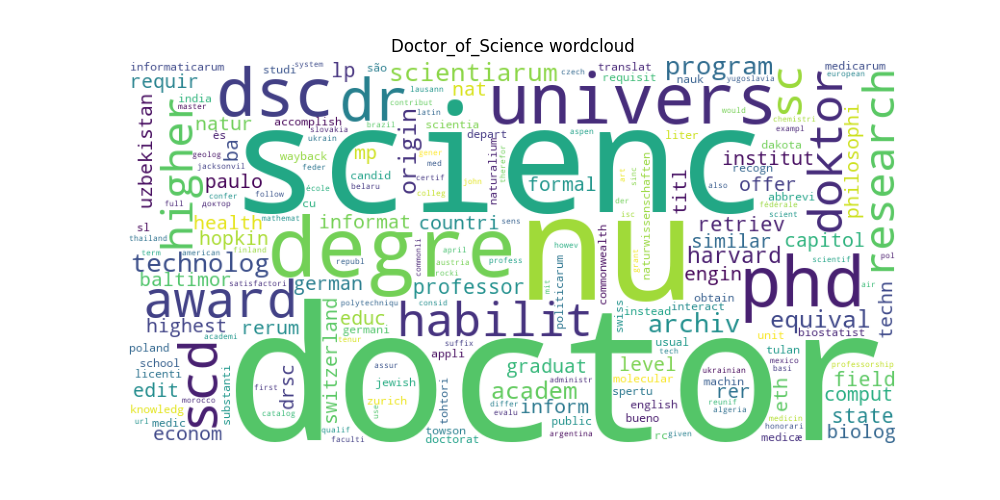

# Project: Wiki Article Relevance Ranking
- Eryk Ptaszyński 151950
- Eryk Walter 151931

## Overview

This project aims to rank wiki articles based on their relevance to a given query of user-visited sites. The algorithm follows several steps to achieve this, including scoring articles and presenting recommendations.

## Algorithm Explanation

### Step 1: Data Collection

We collected data on user-visited sites and a random set of wiki articles. The dataset includes user interactions with wiki articles.

```python
import requests
response = requests.get(link if link else "https://en.wikipedia.org/wiki/Special:Random")
```

We store retrieved wiki articles in `{link: article_text}` python dictionary and later save it to csv.

```python
dict_of_pages[retrieved_link] = article_text
```

### Step 2: Preprocessing

- **Text Cleaning:** Removed stop words, punctuation, and performed lemmatization.
```python
def preprocess_text(self, text):
    words = word_tokenize(text)
    words = [word.lower() for word in words if word.isalpha()]

    stop_words = set(stopwords.words("english"))
    words = [word for word in words if word not in stop_words]

    words = [PorterStemmer().stem(WordNetLemmatizer().lemmatize(word))
                for word in words]
    return " ".join(words)
```

- **TF-IDF Vectorization:** Converted text data into numerical vectors using TF-IDF representation.
```python
def tf_idf(self):
    """
    Implements the TF-IDF algorithm.
    """
    vectorizer = TfidfVectorizer()

    scrapped_articles_keys, scrapped_articles_values = zip(
        *self.scrapped_articles.items())
    scrapped_articles_vectorized = vectorizer.fit_transform(
        scrapped_articles_values)

    visited_articles_keys, visited_articles_values = zip(
        *self.visited_articles.items())
    visited_articles_vectorized = vectorizer.transform(
        visited_articles_values)

    return vectorizer, (visited_articles_keys, visited_articles_vectorized), (scrapped_articles_keys, scrapped_articles_vectorized)
```

### Step 3: Scoring Articles

- **Cosine Similarity:** Computed the cosine similarity between the TF-IDF vectors of articles and user queries.
```python
vectorizer, (query_keys, query_vals), (scrap_keys, scrap_vals) = self.tf_idf()
similarities = cosine_similarity(scrap_vals, query_vals)
similarities = np.mean(similarities, axis=1)
```

### Step 4: Ranking

- **Weighted Sum:** Combined the cosine similarity score and user site weight to rank articles.
```python
scrapped_files_ranking = {url: similarities[idx] for idx, url in enumerate(scrap_keys)}
sorted_ranking = sorted(scrapped_files_ranking.items(), key=lambda x: x[1], reverse=True)
```

## Database Statistics

### Most Frequent Words


### Document Similarities


## Examples of Recommendations

### Recommendation 1

#### Query: [https://en.wikipedia.org/wiki/Pope_John_Paul_II, https://en.wikipedia.org/wiki/Napoleonka]


#### Top 5 Articles:

rank|scores|articles
---|---|---
1|[Marie Gaudin](https://en.wikipedia.org/w/index.php?title=Marie_Gaudin&oldid=1141991329)|`0.13535992551329262`
2|[Counter-Reformation in Poland](https://en.wikipedia.org/w/index.php?title=Counter-Reformation_in_Poland&oldid=1160541478)|`0.1222157785328554`
3|[Denis James](https://en.wikipedia.org/w/index.php?title=Denis_James&oldid=1081981211)|`0.09376063456685456`
4|[Reformed Christian Church in Slovakia](https://en.wikipedia.org/w/index.php?title=Reformed_Christian_Church_in_Slovakia&oldid=1176921981)|`0.09254415614548352`
5|[Kati roll](https://en.wikipedia.org/w/index.php?title=Kati_roll&oldid=1174040948)|`0.0920150110730178`

|1|2|3|4|5|
---|---|---|---|---
 |  |  |  | 

#### Article Relevance Score Histogram:


### Recommendation 2

#### Query: [https://en.wikipedia.org/wiki/Pozna%C5%84_University_of_Technology]


#### Top 5 Articles:

rank|scores|articles
---|---|---
1|[Doctor of Science](https://en.wikipedia.org/w/index.php?title=Doctor_of_Science&oldid=1181230122)|`0.2036485745710449`
2|[Transitional Justice Institute](https://en.wikipedia.org/w/index.php?title=Transitional_Justice_Institute&oldid=1173855381)|`0.1976957705688441`
3|[Federal University of Amazonas](https://en.wikipedia.org/w/index.php?title=Federal_University_of_Amazonas&oldid=1183098245)|`0.18533330819579824`
4|[Education in Kazakhstan](https://en.wikipedia.org/w/index.php?title=Education_in_Kazakhstan&oldid=1157994774)|`0.16196265726197498`
5|[Greenacre School for Girls](https://en.wikipedia.org/w/index.php?title=Greenacre_School_for_Girls&oldid=1179367703)|`0.1452812849746801`

|1|2|3|4|5|
---|---|---|---|---
|||||

#### Article Relevance Score Histogram:


### Recommendation 3

#### Query: [https://en.wikipedia.org/wiki/Film, https://en.wikipedia.org/wiki/Book]


#### Top 5 Articles:

rank|scores|articles
---|---|---
1|[Mahmoud Kalari](https://en.wikipedia.org/w/index.php?title=Mahmoud_Kalari&oldid=1181050667)|`0.2441152496813287`
2|[BoPET](https://en.wikipedia.org/w/index.php?title=BoPET&oldid=1182402711)|`0.23662166286408362`
3|[Photography](https://en.wikipedia.org/w/index.php?title=Photography&oldid=1184952979)|`0.2262585429467926`
4|[Summer Vacation 1999](https://en.wikipedia.org/w/index.php?title=Summer_Vacation_1999&oldid=1185885248)|`0.20454218564508336`
5|[Last Day of Freedom](https://en.wikipedia.org/w/index.php?title=Last_Day_of_Freedom&oldid=1154128561)|`0.17759446401175358`

|1|2|3|4|5|
---|---|---|---|---
|||||

#### Article Relevance Score Histogram:


## Conclusion

This project successfully ranks wiki articles based on relevance to user queries and visited sites. The algorithm's effectiveness is demonstrated through statistical analysis and examples of recommendations.

